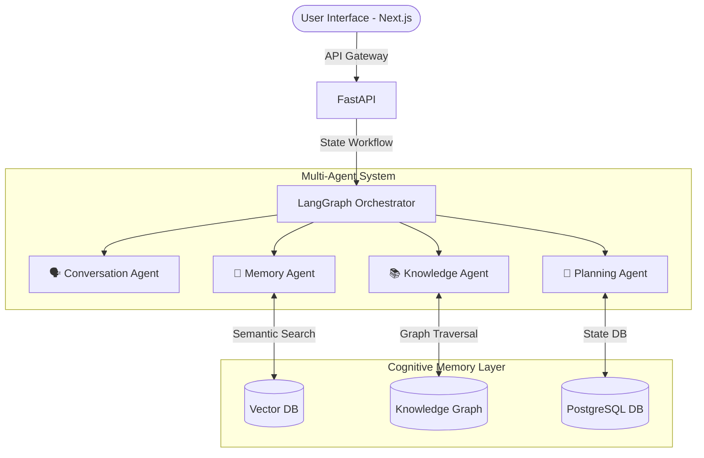

<div align="center">
  

  # 🧠 CogniMind AI
  
  **Enterprise Multi-Agent Personal Assistant with Persistent Memory, Knowledge Graphs, and Autonomous Reasoning**

  [](https://nextjs.org/)
  [](https://fastapi.tiangolo.com/)
  [](https://python.langchain.com/docs/langgraph)
  [](https://neo4j.com/)
  [](https://www.pinecone.io/)
  
  [Overview](#-overview) • [Features](#-core-features) • [Architecture](#-architecture) • [Installation](#-installation) • [Contributing](#-contributing)
</div>

---

## 📖 Overview

**CogniMind AI** is a next-generation, multi-agent AI assistant designed to overcome the limitations of traditional chatbots. It features a **Cognitive Memory Architecture** that allows it to remember user preferences, learn from past interactions, manage long-term memory, perform autonomous tasks, and retrieve contextual knowledge.

By combining **LangGraph orchestration**, **Pinecone Vector Databases**, and **Neo4j Knowledge Graphs**, CogniMind creates a truly personalized AI experience that evolves over months and years of use.

## ✨ Core Features

*   **🧠 Cognitive Memory Architecture**: Implements Working, Episodic, Semantic, and Procedural memory to ensure no context is lost between sessions.
*   **🕸️ Knowledge Graph Reasoning**: Utilizes Neo4j to build dynamic relationships between concepts, users, and tasks, allowing the AI to infer missing context.
*   **🤖 Multi-Agent Orchestration**: Powered by LangGraph, specialized agents (Conversation, Memory, Knowledge, Planning) collaborate to handle complex user workflows.
*   **⚡ Retrieval-Augmented Generation (RAG)**: Fast and semantic information retrieval using Pinecone and ChromaDB.
*   **🔄 Self-Healing & Reflection**: The AI continuously evaluates its own responses, refines its memory rankings, and learns from user interactions.

## 🏗️ Architecture



## 💻 Technology Stack

| Component | Technology | Description |
| :--- | :--- | :--- |
| **Frontend** | `Next.js 15`, `React`, `Tailwind CSS`, `Framer Motion` | Modern, glassmorphic UI with micro-animations. |
| **Backend** | `FastAPI`, `Python 3.10+` | High-performance async API backend. |
| **AI & Orchestration** | `LangGraph`, `LangChain`, `OpenAI` | Multi-agent state orchestration and LLM integration. |
| **Memory Systems** | `Pinecone`, `Neo4j` | Vector embeddings for episodic memory and Graph DB for semantic relationships. |

## 🚀 Installation & Setup

### Prerequisites
*   Node.js 18+
*   Python 3.10+
*   API Keys: OpenAI, Pinecone, Neo4j

### 1. Backend Setup

```bash
# Clone the repository
git clone https://github.com/Rxhulnxyak/CogniMind-AI.git
cd CogniMind-AI/backend

# Install dependencies
pip install -r requirements.txt

# Configure Environment Variables
cp .env.example .env
# Edit .env and add your API keys

# Run the FastAPI server
uvicorn main:app --reload
```

### 2. Frontend Setup

```bash
# Navigate to frontend directory
cd ../frontend

# Install packages
npm install

# Run the development server
npm run dev
```
Open [http://localhost:3000](http://localhost:3000) in your browser. The backend API runs on `http://localhost:8000`.

## 🔒 Security & Privacy
*   **Memory Encryption**: AES-256 encryption for all stored memories.
*   **RBAC**: Role-based access control built into the PostgreSQL schema.
*   **User Privacy Controls**: Users have full autonomy to view, edit, or delete their episodic and semantic memories.

## 🤝 Contributing
Contributions are what make the open source community such an amazing place to learn, inspire, and create. Any contributions you make are **greatly appreciated**.

1. Fork the Project
2. Create your Feature Branch (`git checkout -b feature/AmazingFeature`)
3. Commit your Changes (`git commit -m 'Add some AmazingFeature'`)
4. Push to the Branch (`git push origin feature/AmazingFeature`)
5. Open a Pull Request

## 📄 License
Distributed under the MIT License. See `LICENSE` for more information.

---
<div align="center">
  <i>Built with ❤️ for the future of Autonomous Reasoning.</i>
</div>
